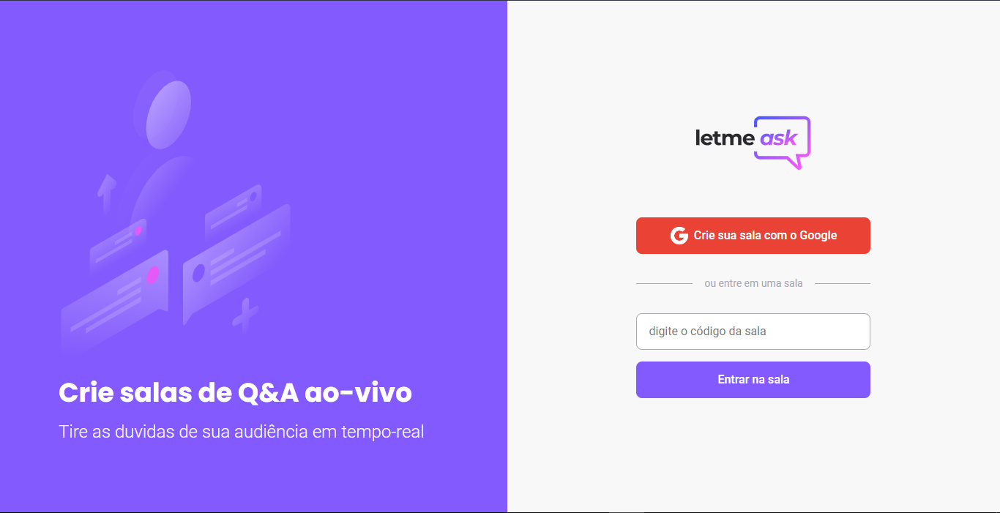

<h1 align="center">
    
</h1>

  <a href="#-tecnologias">Tecnologias</a>&nbsp;&nbsp;&nbsp;|&nbsp;&nbsp;&nbsp;
  <a href="#-projeto">Projeto</a>&nbsp;&nbsp;&nbsp;|&nbsp;&nbsp;&nbsp;
  <a href="#-layout">Layout</a>&nbsp;&nbsp;&nbsp;|&nbsp;&nbsp;&nbsp;
  <a href="#-creditos">Creditos</a>

 

  

## 🚀 Tecnologias

Esse projeto foi desenvolvido com as seguintes tecnologias:

- [React](https://reactjs.org)
- [Expo](https://expo.io/)
- [Firebase](https://firebase.google.com/)
- [TypeScript](https://www.typescriptlang.org/)

## 💻 Projeto

O Letmeask é um app para Streamers e para seu publico, possibilitando o pessoal a fazerem perguntas em tempo real.

## 🔖 Layout

Nos links abaixo você encontra o layout do projeto. Lembrando que você precisa ter uma conta no [Figma](http://figma.com/) para acessá-lo.

- [Layout](https://www.figma.com/file/u0BQK8rCf2KgzcukdRRCWh/Letmeask/duplicate)

## 👊 Creditos

Ao Diego CTO da rocketseat e a todos da rocketseat por trazer essa semana maravilhosa cheia de conteúdo muito top!

- [Diego - Github](https://github.com/diego3g)
- [Rocketseat - Github ](https://github.com/rocketseat-education)
- [Rocketseat - Youtube](https://www.youtube.com/channel/UCSfwM5u0Kce6Cce8_S72olg)
- [Rocketseat - Discord](https://discordapp.com/invite/gCRAFhc)

## :memo: Licença

Esse projeto está sob a licença MIT. Veja o arquivo [LICENSE](LICENSE.md) para mais detalhes.

---

Feito com ♥ by Renan Alves :wave:
